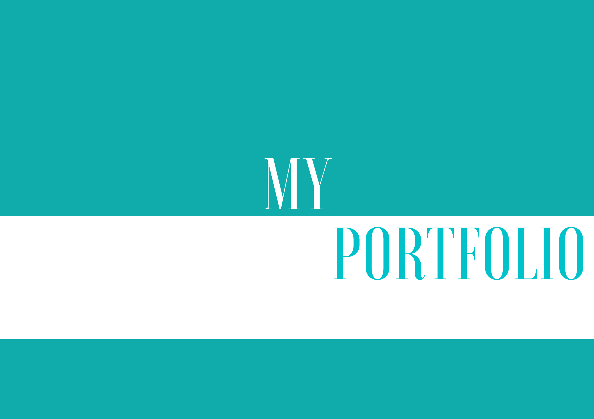

  

<h1 align="rigth">Meu Portfolio</h1>

## Visão geral

Página dedicada às atualizações dos meus projetos e habilidades.

Badges

search / project URL

emailjs
fortawesom
react-fontawesome
animate.css
gsap-trial
loaders.css
react-loaders
react-router-dom
npm sass

Paleta de cores: "Alta tecnologia: Empresas de tecnologia optam muito pelo uso do azul que simboliza confiança, inteligência e eficiência." - Wix Blog -https://pt.wix.com/blog/2020/02/como-escolher-as-cores-da-sua-marca
